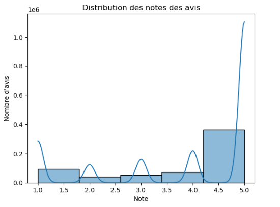
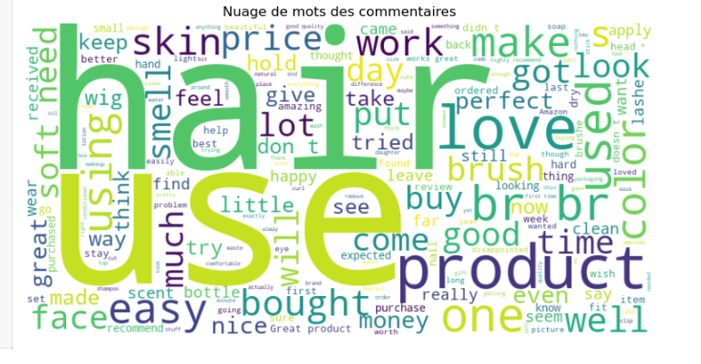
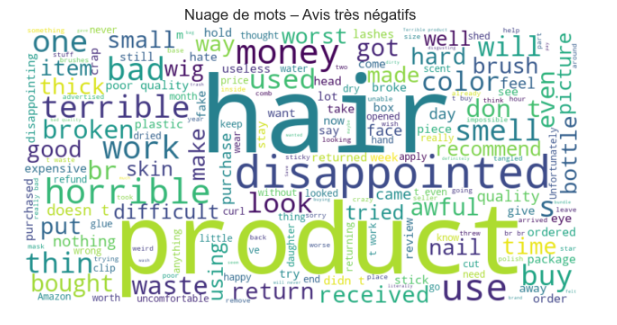
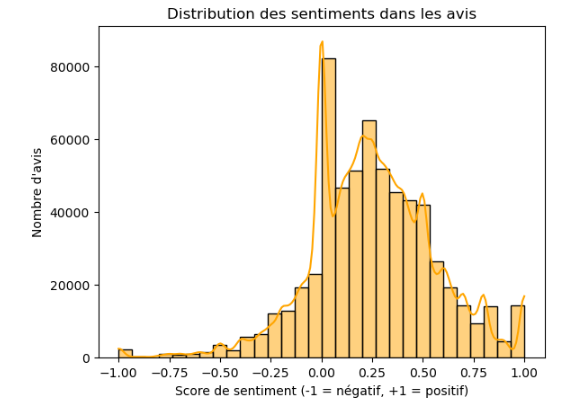
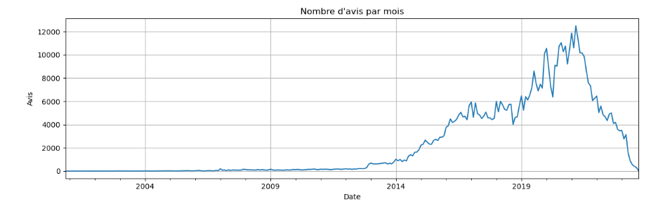

# Analyse-des-avis-clients-Amazon-Catégorie-Beauté

## 📚 Sommaire

- [🧭 Présentation du projet](#🧭-présentation-du-projet)
- [🎯 Objectifs du projet](#🎯-objectifs-du-projet)
- [🛠️ Technologies utilisées](#️-technologies-utilisées)
- [📊 Visualisations](#📊-visualisations)
- [🔍 Étapes de l’analyse](#🔍-étapes-de-lanalyse)
- [🧾 Conclusion & recommandations](#🧾-conclusion--recommandations)
- [🚀 Pistes d’évolution du projet](#🚀-pistes-dévolution-du-projet)

## 🧭 Présentation du projet
Ce projet vise à analyser les commentaires des clients sur Amazon dans la section produits de beauté, afin de mieux saisir les perceptions, les aspects positifs et les domaines nécessitant des améliorations identifiés par les utilisateurs.

 Le jeu de données utilisé provient d'Amazon Reviews 2023, publié par le McAuley : https://github.com/McAuley-Lab  et accessible sans frais sur la plateforme Hugging Face : https://huggingface.co/datasets/McAuley-Lab/Amazon-Reviews-2023  . 👉  Fichier en cours d'utilisation : All_Beauty.jsonl.gz

## 🎯 Objectifs du projet
Ce projet a pour objectif de :
- Analyser les commentaires des clients sur Amazon dans la section Beauté afin de dégager des conclusions précises
- Évaluer le ressenti des utilisateurs à travers le texte libre : contentement, critiques, aspects délicats
- Observation des tendances : répartition des notes, progression dans le temps, fréquence des thèmes répétitifs
- Comparer les commentaires authentiques et non authentiques afin de déceler les divergences de perception
- Mettre en pratique une méthode d'analyse simple mais solide en Python à l'aide d'outils disponibles

L'intégralité du processus est conçu pour être réplicable, aisément modifiable pour d'autres produits, et démontrer ta compétence à convertir des informations textuelles brutes en décisions réfléchies.

## 🛠️ Technologies utilisées

| Librairie / Outil         | Usage principal                                                                 |
|---------------------------|----------------------------------------------------------------------------------|
| `pandas`                  | Manipulation de données, nettoyage, traitement tabulaire                        |
| `matplotlib`, `seaborn`   | Visualisations : histogrammes, courbes, boxplots                                |
| `wordcloud`               | Génération de nuages de mots à partir des commentaires clients                  |
| `TextBlob`                | Analyse de sentiment textuel simple et accessible                               |
| `json`, `gzip`            | Chargement et lecture de fichiers `.jsonl.gz`                                   |
| `tqdm`                    | Suivi visuel de la progression lors du traitement des avis                      |
| `Jupyter Notebook`        | Présentation interactive du projet avec exécution pas-à-pas                     |

## 📊  Visualisations
Cette partie compile les principales visualisations provenant de l'étude des commentaires clients sur Amazon (secteur Beauté).  Ces représentations facilitent un résumé rapide des tendances, des opinions clients et des aspects critiques mentionnés dans les retours :
 ## 📈 Distribution des notes : Histogramme des évaluations (de 1 à 5 étoiles), pour visualiser le niveau général de satisfaction.

  

Le graphique révèle que la plupart des clients évaluent hautement les produits cosmétiques sur Amazon, avec une forte concentration autour de 4 à 5 étoiles.  Les commentaires défavorables demeurent peu fréquents, traduisant un grand degré de contentement général.  Avec plus de 700 000 avis, l'ampleur du jeu de données renforce la crédibilité de cette tendance et incite à une étude plus détaillée du contenu des commentaires afin de saisir ce qui séduit véritablement les utilisateurs. 

## ☁️ Nuage de mot des commentaires : Synthèse des mots les plus utilisés dans les commentaires clients. Idéal pour repérer les tendances spontanées.

 

Le nuage de mots souligne les inquiétudes fréquemment manifestées par les clients dans leurs commentaires.  Cela met en évidence des sujets liés à l'utilisation quotidienne des produits, aux expériences qu'ils offrent et à leur qualité perçue.  On note une perception généralement favorable concernant l'expérience utilisateur et la dimension sensorielle des produits.  Cette forme de représentation permet de saisir l'essence des commentaires d'un seul coup d'œil, dévoilant ce dont les clients parlent le plus spontanément. 

## ☁️ Nuage de mots – avis négatifs : Zoom visuel sur les mots les plus cités dans les commentaires les plus critiques (sentiment très bas).

Ce nuage souligne de manière visuelle les points soulevés par les clients les plus exigeants.  Il représente une compilation de sentiments négatifs associés à des soucis d'efficacité, de confort ou de satisfaction générale.  La structure et la concentration des termes révèlent un degré d'insatisfaction spécifique, facilitant l'identification rapide des sources de mécontentement les plus fréquentes.  C'est un instrument pratique pour identifier ce qui se retrouve fréquemment dans les critiques les plus négatives sans avoir à effectuer une lecture complète.

## Visualisation des scores de sentiment

Ce graphique démontre la répartition des notes d'opinion attribuées aux commentaires des clients concernant les produits cosmétiques.  Il révèle une forte concentration autour de la neutralité, avec une prédominance d'opinions exprimant des sentiments modérés ou légèrement positifs.  La courbe, lissée, reflète une tendance centrale assez équilibrée, sans présence significative d’extrêmes négatifs ou très positifs.  Cette représentation offre une évaluation rapide du ton global des commentaires, ni trop critique, ni trop enthousiaste, indiquant ainsi des opinions généralement équilibrées.

## Visualisation temporelle des avis

Ce graphique met en lumière la progression mensuelle du nombre de critiques sur les produits cosmétiques, sur une durée s'étendant de 2004 à 2023.  On note une augmentation graduelle culminant entre 2018 et 2019, suivie d'une chute marquée à partir de 2020.  Ce graphique illustre les variations de l'engagement des clients sur la plateforme, qui peuvent être le résultat de tendances de consommation, d'effets saisonniers ou d'événements externes.  Elle offre la possibilité de repérer les moments où l'implication du client était la plus intense, et ceux où elle a diminué, fournissant des perspectives sur l'évolution du comportement d'achat au fil du temps.

## Sentiment selon achat vérifié ou non

Ce graphique montre la distribution des scores de sentiment en fonction de la confirmation ou non de l'achat du produit.  Il illustre visuellement les variations de tonalité dans les commentaires entre les clients identifiés et ceux qui ne le sont pas.  On observe que les commentaires provenant d'achats authentifiés tendent à avoir une polarité un peu plus positive et plus centrée, alors que ceux non authentifiés montrent une variation plus étendue.  Cela indique une association entre la confirmation d'achat et la crédibilité ou l'intonation des commentaires des clients, et encourage à prendre en compte ce facteur lors de l'évaluation de la perception globale.
